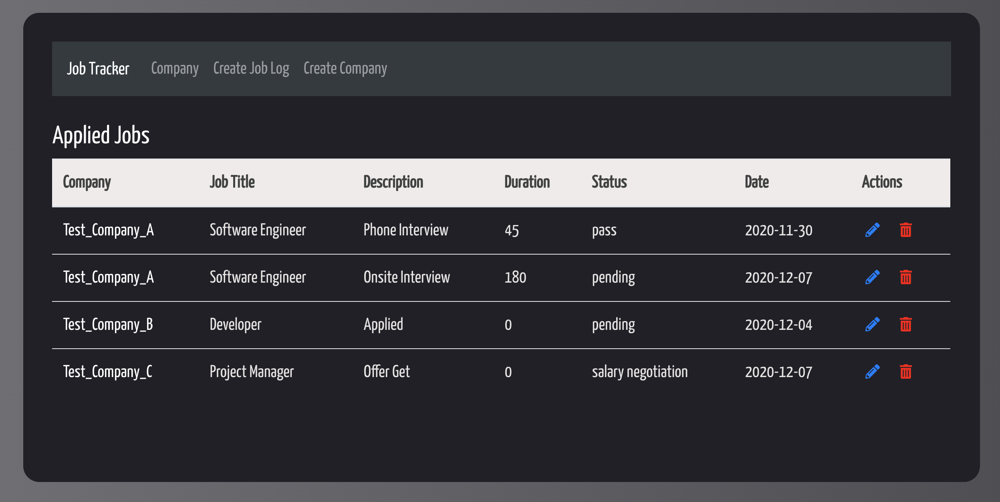

# Job Application Tracker
A **single-page web application** that improves the efficiency of the job-seeking process by managing and tracking the progress of job applications online. [Try it out!](http://3.25.86.157/)
## Overview
This app is built with the **MERN stack**. We integrated different frontend techniques to create a user-friendly interface. Moreover, it is responsive to all major browsers and devices. The quick guide is as follows:  
* **Job Tracker:** It takes the user back to the home page and presents the list of applied jobs.
* **Company:** It displays various company information entered by the user.
* **Create Job Log:** It allows the user to input the progress of the job application to be tracked.
* **Create Company:** It allows the user to input the details of a company to be tracked.

<!--
  
-->

## Directory Structure

    Job-Tracker-MERN
    ├── README.md
    │
    ├── react_frontend              
    │   └─── src 
    │        ├── index.js
    │        ├── App.js
    │        ├── package.json         
    │        └── components           # Component files
    │           
    ├── node_modules
    │
    └── backend
        ├── server.js
        ├── package.json
        ├── .env
        ├── routes                    # Server API endpoint routes files
        └── models                    # Database schema files
        
